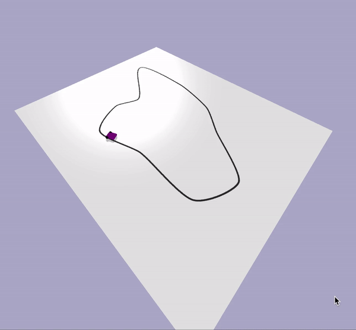
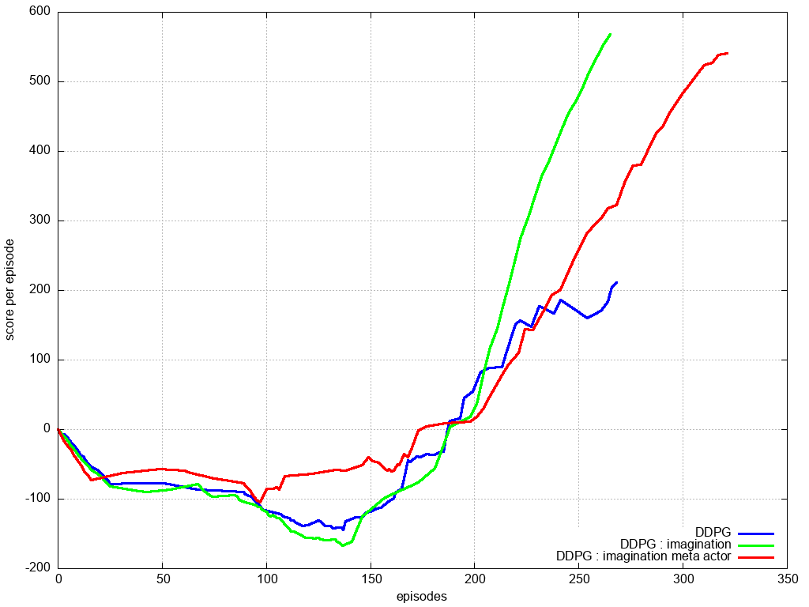
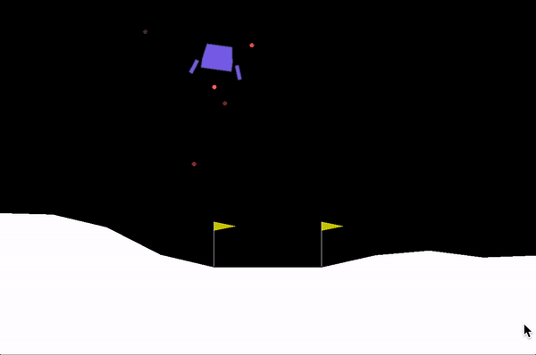
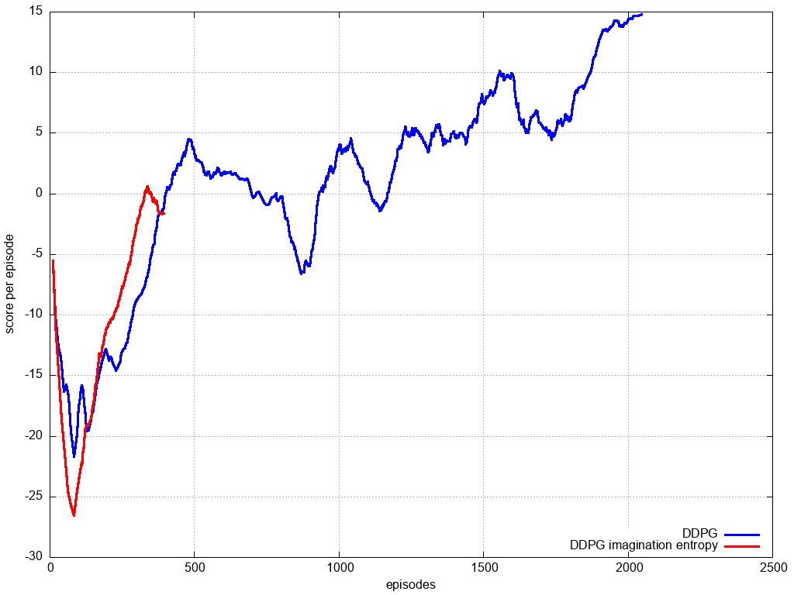
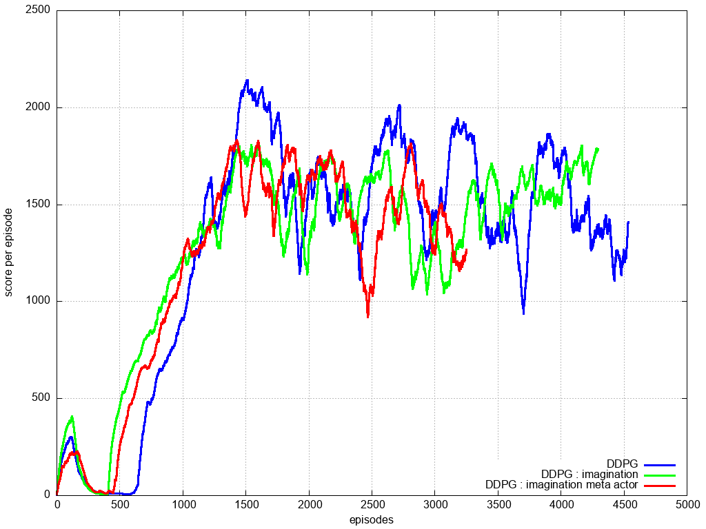

# imagination_reinforcement_learning
imagination RL experiments

# 0 line follower

* DDPG : common ddpg
* DDPG + imagination : DDPG imagination (4 rollouts + 4 steps) and bonus reward from imagination
* DDPG + imagination with meta-actor : imagined sttes entropty maximization exploration

# 1 lunar lander

* DDPG : common ddpg
* DDPG + imagination : DDPG imagination (4 rollouts + 4 steps) and bonus reward from imagination
* DDPG + imagination with meta-actor : imagined sttes entropty maximization exploration

# 2 pybullet Ant walking

* DDPG : common ddpg
* DDPG + imagination : DDPG imagination (4 rollouts + 4 steps) and bonus reward from imagination
* DDPG + imagination with meta-actor : imagined sttes entropty maximization exploration

# 4 atari pacman

last conv. layer attention visualisation

pacman with curiosity - forward model for state prediction used

# dependences
cmake python3 pip3 swig
numpy numpy matplotlib torch pillow opencv-python 

envs : gym pybullet pybulletgym 'gym[atari]' 'gym[box2d]' gym-super-mario-bros gym_2048