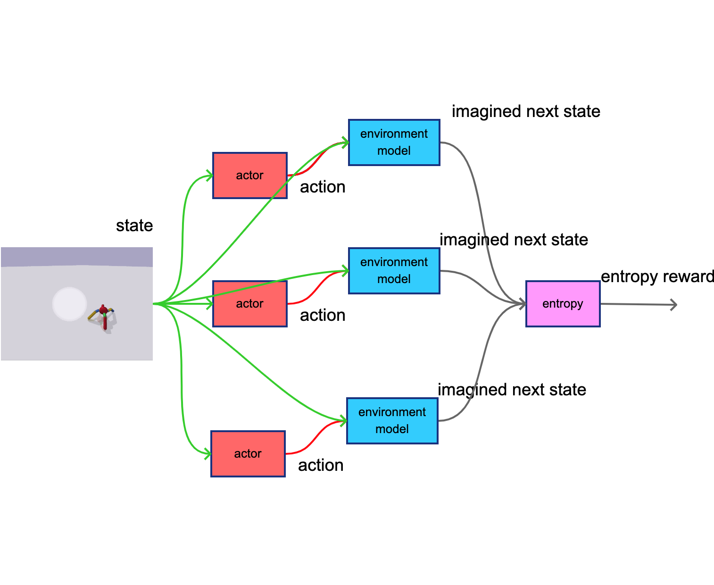
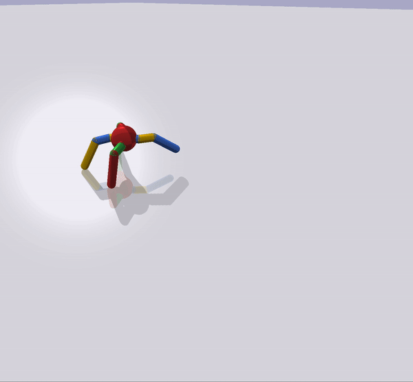
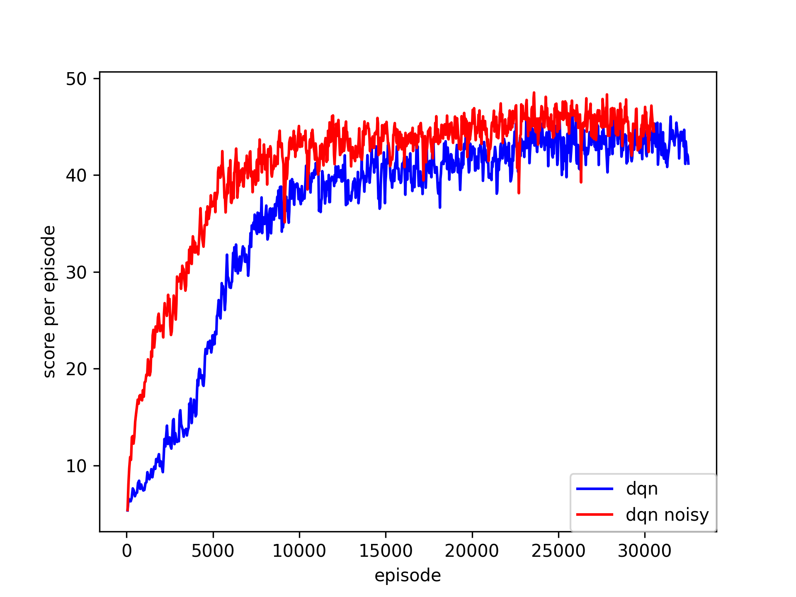

# imagination_reinforcement_learning
imagination RL experiments

DDPG with imagination entropy reward main idea :

main parts :
- environment model - trained to predict next state from current state and action
- actor - DDPG actor
- entropy calculation (+scaling and tanh squashing)

the current state is runned in M-rollouts (3 on figure),
and N-steps (one step on figure)
terminal imagined states are used to compute entropy
**higher entropy produce higher internal motivation**

detail used models for actor, critic and forward env model

# 2 pybullet Ant

* DDPG : common ddpg
* DDPG imagination entropy : DDPG imagination and bonus reward from imagination entropy

# 3 pybullet Half Cheetah

* DDPG : common ddpg
* DDPG imagination entropy : DDPG imagination and bonus reward from imagination entropy

# 4 pybullet Ghost Minitaur

* DDPG : common ddpg
* DDPG imagination entropy : DDPG imagination and bonus reward from imagination entropy

# 4 atari pacman

detail of DQN and env model

last conv. layer attention visualisation

pacman with curiosity - forward model for state prediction used

# dependences
cmake python3 python3-pip

**basic python libs**
pip3 install numpy matplotlib torch torchviz pillow opencv-python networkx

**graph neural networks**
when CPU only :

pip3 install torch_geometric torch_sparse torch_scatter

for CUDA different packages are reuired :
- this is for cuda 10.2
- and pytorch 1.6

pip3 install torch-scatter==latest+cu102 -f https://pytorch-geometric.com/whl/torch-1.6.0.html
pip3 install torch-sparse==latest+cu102 -f https://pytorch-geometric.com/whl/torch-1.6.0.html
pip3 install torch-cluster==latest+cu102 -f https://pytorch-geometric.com/whl/torch-1.6.0.html
pip3 install torch-spline-conv==latest+cu102 -f https://pytorch-geometric.com/whl/torch-1.6.0.html
pip3 install torch-geometric

see https://pytorch-geometric.readthedocs.io/en/latest/notes/installation.html

**environments**
pip3 install  gym pybullet pybulletgym 'gym[atari]' 'gym[box2d]' gym-super-mario-bros gym_2048